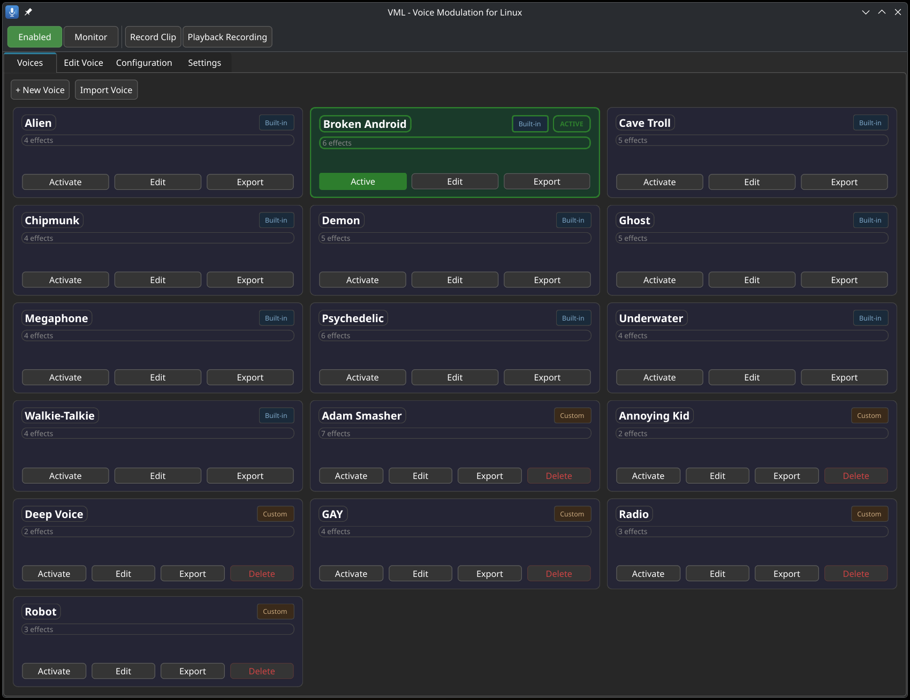
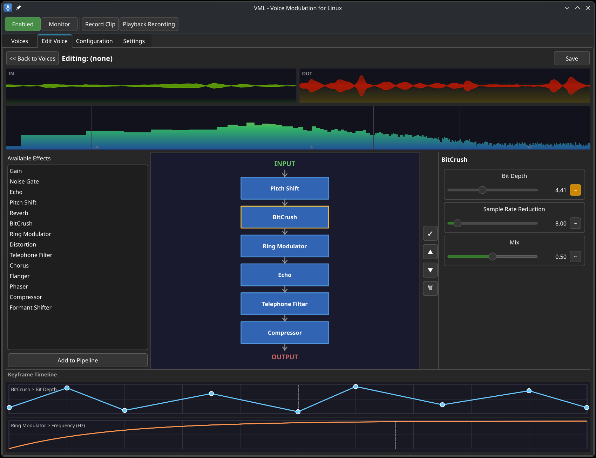

<p align="center">
  
</p>

<h1 align="center">VML - Voice Modulation for Linux</h1>

<p align="center">
Real-time voice effects processor that creates a virtual microphone through PipeWire.<br>
Apply pitch shifting, reverb, echo, bitcrushing, and more to your voice, then select "VML Virtual Microphone" in Discord, OBS, or any application.
</p>

<p align="center">
  
  
  
  
  
  
</p>

<p align="center">
  
</p>

## Features

| Feature                | Description |
|------------------------|-------------|
| **Virtual Microphone** | Appears as a standard PipeWire audio source |
| **14 Built-in Effects** | `Gain`, `Noise Gate`, `Pitch Shift`, `Echo`, `Reverb`, `BitCrush`, `Ring Modulator`, `Distortion`, `Telephone Filter`, `Chorus`, `Flanger`, `Phaser`, `Compressor`, `Formant Shifter` |
| **Effect Pipeline**    | Chain effects in any order, reorder them and tweak to your liking |
| **Parameter Modulation** | Automate any parameter with looping LFO-style sweeps (linear, ease in/out, rubberband, keyframe curves) |
| **Audio Clip Recorder** | Record 3 seconds of mic input, then loop it through your effect chain for hands-free testing |
| **Profiles**           | Save/load effect chains with presets included (Deep Voice, Robot, Radio) |
| **System Tray**        | Switch profiles, toggle processing, and monitor audio without opening the window |
| **Low Latency**        | ~5ms processing at 256 frames / 48kHz |

## Voice Editor

<p align="center">
  
</p>

Each voice is a fully customizable effect pipeline. In the editor you can:
- Add, remove, and reorder effects in the signal chain
- Adjust every parameter per effect with real-time sliders
- Attach modulators to any parameter for automatic sweeps with multiple curve types
- Edit keyframe curves visually in the resizable timeline at the bottom
- Record a short mic clip and loop it through the chain for hands-free previewing
- Monitor input/output waveforms and spectrum while tweaking


## Quick Install

```bash
curl -fsSL https://raw.githubusercontent.com/Zebratic/voice-modulation-linux/main/scripts/install.sh | bash
```

Or clone and run locally:

```bash
git clone https://github.com/Zebratic/voice-modulation-linux.git
cd voice-modulation-linux
bash scripts/install.sh
```

The install script detects your package manager (pacman / apt / dnf), installs dependencies, builds from source, and installs to `/usr/local`.

## Manual Build

```bash
mkdir build && cd build
cmake .. -DCMAKE_BUILD_TYPE=Release
make -j$(nproc)
sudo make install
```

### Dependencies

| Dependency | Arch | Debian/Ubuntu | Fedora |
|---|---|---|---|
| Qt6 | `qt6-base` | `qt6-base-dev` | `qt6-qtbase-devel` |
| PipeWire | `pipewire` | `libpipewire-0.3-dev` | `pipewire-devel` |
| CMake 3.20+ | `cmake` | `cmake` | `cmake` |
| C++20 compiler | `gcc` | `g++` | `gcc-c++` |

## Usage

1. Launch VML: `vml`
2. Pick effects from the list on the left and add them to the pipeline
3. Click an effect block to adjust its parameters with sliders
4. In your app (Discord, Zoom, OBS), select **VML Virtual Microphone** as the input device
5. Save your setup as a profile

### Parameter Modulation

Click the **~** button next to any slider to attach a modulator. Set a start value, end value, duration, and curve shape, the parameter will sweep back and forth continuously (ping-pong). Multiple modulators can run simultaneously on different parameters.

Curve types: Linear, Ease In/Out (smoothstep), Rubberband (fast attack), Keyframe (custom breakpoints).

### Clip Recorder

Click **Record 3s Clip** in the toolbar to capture mic input. Then enable **Loop Playback** to feed the recorded clip through your effect chain on repeat, useful for tweaking effects without talking.

### System Tray

Right-click the tray icon to switch profiles, enable/disable processing, or toggle audio monitor.

## Roadmap

- [x] Real-time parameter sliders per effect
- [x] Parameter modulation with multiple curve types (linear, ease in/out, rubberband, keyframe)
- [x] Visual keyframe timeline editor with resizable panel
- [x] Profile system with save/load/import/export
- [x] Built-in voice presets (Deep Voice, Robot, Radio, etc.)
- [x] Audio clip recorder with loop playback
- [x] Input/output waveform and spectrum visualizer
- [x] System tray with profile switching and quick toggles
- [x] Dark/light theme support
- [x] Input and monitor output device selection
- [x] One-click install script (pacman/apt/dnf)
- [x] Renaming of the virtual mic input
- [ ] Global hotkeys to switch voice profiles
- [ ] Parametric EQ effect
- [ ] Noise suppression (AI or spectral)
- [ ] Per-application audio routing
- [ ] Undo/redo for pipeline and parameter changes
- [ ] Audio ducking / sidechain input

## Uninstall

```bash
bash scripts/install.sh --uninstall
```


## License

GPL-3.0. See [LICENSE](LICENSE).
